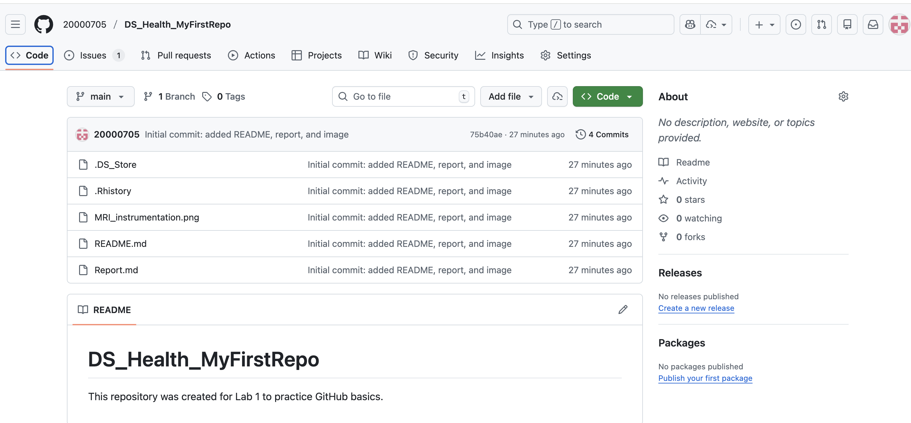

# Lab 1 – GitHub Basics

## 1. Story

For this lab, I created a new GitHub repository called **DS_Health_MyFirstRepo** in my personal GitHub account.

After creating the repository on GitHub, I cloned it to my local computer using the `git clone` command. This allowed me to work on the project locally. Inside the folder, I created a `README.md` file to describe the project and a `Report.md` file to document what I did for this lab.

I also added an image file called `MRI_instrumentation.png` to the repository.

Once all files were added, I used Git commands to upload my work:
- `git add .` to stage the files  
- `git commit -m "Initial commit: added README, report, and image"` to save a snapshot of my changes
- `git pull --rebase origin main` and `git push` to send the changes to GitHub  

After pushing my work to GitHub, I created a GitHub Issue in the repository to practice using GitHub’s issue-tracking system. This helped me understand how tasks and ideas can be managed within a project.

---

## 2. Reflection: What I Learned

From this lab, I learned that **Git** is a version control system that tracks changes in files, while **GitHub** is an online platform that hosts Git repositories and makes collaboration easier.

I learned how to:
- Create a repository on GitHub  
- Clone a repository to my local computer  
- Add files to a project  
- Commit and push changes  
- Use Issues to track work  

I also learned what happens when the remote GitHub repository already contains commits. When my first `git push` was rejected, I learned that I needed to run `git pull --rebase origin main` to synchronize my local history with the remote repository before pushing again.

I am still a little confused about when to use **branches** versus **forks**, especially in large collaborative projects. I understand that both are used to work on different versions of a project, but I would like more practice to fully understand their differences.

---

## 3. Markdown Styling Demo

Here is an example of **bold text** and *italic text*.

Here is a bullet list:
- Git
- GitHub
- Markdown

Here is a numbered list:
1. Create a repository  
2. Clone the repository  
3. Add files  
4. Commit and push

Here are some colored words using HTML in Markdown:
- Git tracks changes  
- GitHub hosts repositories  
- Markdown formats documents  

Here is a table:
| Command | Purpose |
|--------|---------|
| `git clone` | Download a repository |
| `git add` | Stage files for commit |
| `git commit` | Save a checkpoint |
| `git push` | Upload changes to GitHub |

---

## 4. Visual Evidence

### Screenshot of my GitHub repository or issue

### Image added to this repository

